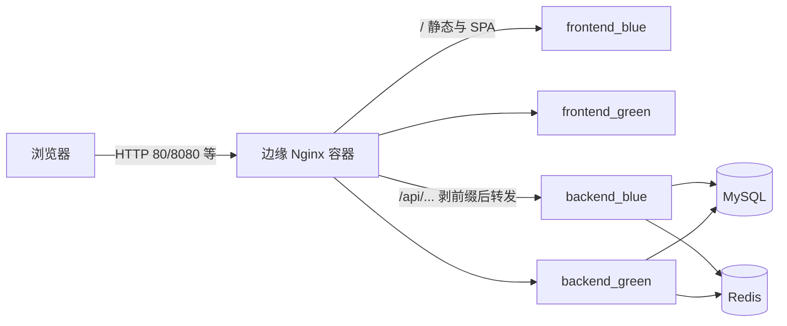

# 部署说明（前端工程师视角）

本文面向不熟悉运维与 Docker 的前端同学，说明 **deploy-infra** 仓库里各文件在真实环境里扮演什么角色、数据如何流动、以及「改代码 → 上线」通常走哪条路径。

---

## 1. 这个仓库是干什么的？

**一句话**：在阿里云 ECS 上用 **Docker Compose** 跑一整套「AI 前端静态站 + Nest 后端 + MySQL + Redis」，外面再套一层 **边缘 Nginx** 做统一入口和 **蓝绿发布**（零停机切换版本）。

和你日常工作的关系：

- **ai-frontend** 仓库：你写 Vue/React 等，构建出静态文件，打成 **镜像** 推到阿里云 ACR。
- **ai-backend** 仓库：后端同学同样打镜像推 ACR。
- **本仓库（deploy-infra）**：在服务器上 **拉镜像、起容器、改 Nginx 指向哪一套容器**，不负责业务代码编译（编译在各自仓库的 CI 里完成）。

---

## 2. 整体架构（谁在访问谁）



要点：

- 用户**只访问边缘 Nginx 映射到宿主机的端口**（由 `PUBLIC_HTTP_PORT` 决定，见各环境 `ai.env`）。
- **同一时间**，边缘只会把流量打到 **一对**「当前活跃」槽位：例如 `frontend_blue` + `backend_green`。另一套 blue/green 要么不存在，要么是刚拉起、还没切流量，要么是上一轮已被删掉。
- 前端容器本质是 **Nginx 托管 `dist`**；后端容器跑 **Node 3000 端口**。

---

## 3. 浏览器请求怎么走（和前端最相关）

边缘路由写在 `projects/ai/nginx/conf.d/20-default.conf`：

| 路径 | 行为 |
|------|------|
| `/health` | 边缘自己返回 `edge-ok`，用来判断「入口 Nginx 活着」 |
| `/api/health` | 转发到后端的 `/health`（后端没有 `/api` 前缀） |
| `/api/...` | **`proxy_pass` 末尾带 `/`**，会把 **`/api` 前缀剥掉** 再交给 Nest。例如 `/api/video/process` → 上游收到 `/video/process` |
| `/` 及其他 | 转到当前 **frontend_active**（静态资源 + SPA） |

**前端配置陷阱（README 里也强调过）**：

- 构建时 **不要把 `VITE_API_BASE_URL` 写成 `http://localhost:3000`** 或任意「用户电脑上才有的地址」。线上浏览器会请求错主机。
- 正确做法是基址用 **`/api`** 或与页面 **同源** 的相对路径，让请求仍然打到 **边缘 Nginx**，再由边缘转发到后端。

`10-upstreams.conf` 里的 `frontend_active` / `backend_active` 是 **脚本生成的别名**，指向当前 blue 或 green 容器组；**不要**在发版过程中手改该文件，除非你在做排障且明白后果。

---

## 4. 目录与文件「场景说明」速查

### 4.1 `projects/ai/`（真正在服务器上 `docker compose` 的目录）

| 文件 / 目录 | 使用场景 |
|-------------|----------|
| `compose.yml` | 定义全部服务：边缘 `nginx`、两套 `frontend_*`、两套 `backend_*`、`mysql`、`redis`、数据卷与健康检查。改这里等于改「整机拓扑」。 |
| `project.env` | **跨环境共用**的默认值：镜像仓库 `REGISTRY`/`NAMESPACE`、四个 `TAG_*`（蓝绿各槽位用哪版镜像）、数据库默认账号、`PUBLIC_HTTP_PORT` 默认等。**会进 git**，不要放真实生产密码。 |
| `.env.local`（可选） | **本机/服务器私有**：ACR 密码、`MYSQL_ROOT_PASSWORD` 等敏感项。从 `.env.local.example` 复制，**已被 .gitignore**。 |
| `nginx/nginx.conf` | 边缘 Nginx 主配置；`include conf.d/*.conf`。 |
| `nginx/conf.d/20-default.conf` | **路由规则**（/health、/api、/），一般按业务改 API 前缀、超时、`client_max_body_size` 等。 |
| `nginx/conf.d/10-upstreams.conf` | **由脚本重写**，声明 `frontend_active`、`backend_active` 指向哪个槽位。 |
| `state/frontend.active`、`state/backend.active` | 记录**当前流量在哪一侧**（`blue` 或 `green`）。 |
| `state/rollback/` | 蓝绿脚本部署前打的 **快照**（upstream + active 指针），供 `rollback.sh` 恢复。 |

### 4.2 `environments/{dev,test,prod}/ai.env`

**按环境覆盖**变量：例如 `NODE_ENV`、`PUBLIC_HTTP_PORT`、`PUBLIC_BASE_URL`、`CORS_ORIGIN`、`DB_NAME`、`DB_SYNC` 等。

典型区别（具体以文件为准）：

- **dev**：端口常错开（如 8080）、`DB_SYNC=true` 方便自动建表、库名 `ai_dev`。
- **test**：如 8081、`ai_test`。
- **prod**：80 或你们约定端口、`PUBLIC_BASE_URL` / `CORS_ORIGIN` 填真实站点、**生产关闭** `DB_SYNC`、库名 `ai_prod`。

Compose 启动时 **叠加顺序**（见 `scripts/lib.sh`）：

1. `projects/ai/project.env`
2. `environments/<env>/ai.env`
3. 若存在：`projects/ai/.env.local`

后面的文件会覆盖前面同名变量。

### 4.3 `scripts/`

| 脚本 | 什么时候用 |
|------|------------|
| `lib.sh` | 被其他脚本 `source`，定义 `compose` 封装、`write_upstreams`、健康检查等。**不单独执行。** |
| `deploy.sh [dev\|test\|prod]` | **首次**或运维「整栈拉起」：`docker compose up -d`。不做蓝绿切换逻辑。 |
| `blue-green-deploy.sh` | **发版主路径**：对 frontend 或 backend **起非活跃槽位 → 健康检查 → 改 upstream → reload Nginx → 边缘探活 → 删旧容器**。 |
| `switch.sh` | **不切镜像**，只把流量指到指定 blue/green（例如紧急指回旧槽位，且旧容器还在）。 |
| `rollback.sh` | 用**上一次部署前**保存的快照恢复 `10-upstreams.conf` 和 `*.active`。**不会**自动把已删的容器变回来。 |
| `health-check.sh` | 在宿主上 `curl` 边缘的 `/health` 与 `/api/health`，快速验入口。 |
| `login-acr.sh` | 本机或 ECS 上 **`docker login` 阿里云 ACR**，读 `project.env` + `.env.local`。 |

### 4.4 `templates/`

这些是 **给业务仓库拷贝的模板**，不在本仓库运行时直接使用：

| 路径 | 用途 |
|------|------|
| `templates/docker/frontend.Dockerfile` | 拷到 **ai-frontend** 根目录：多阶段构建 + Nginx 托管 dist。 |
| `templates/docker/backend.Dockerfile` | 拷到 **ai-backend** 根目录。 |
| `templates/docker/docker-nginx-default.conf` | 前端镜像 **内部** Nginx 参考（与边缘 `20-default.conf` 不是同一个）。 |
| `templates/github/ai-frontend-ci-cd.yml` | 拷成 ai-frontend 的 `.github/workflows/ci-cd.yml`：构建、推镜像、SSH 调 `blue-green-deploy.sh frontend`。 |
| `templates/github/ai-backend-ci-cd.yml` | 同上，后端。 |

### 4.5 `.github/workflows/validate-compose.yml`

**本仓库**在 PR / push 时跑 `docker compose config`，校验 `compose.yml` + 默认 env 是否合法。**不部署、不登录 ACR。**

### 4.6 `docs/GITHUB_SECRETS.md`

列出 **ai-frontend / ai-backend** 要在 GitHub 里配的 Secrets（ACR、SSH 等）。deploy-infra 本身一般不配这些。

---

## 5. 端到端流程：从你 `git push` 到用户看到新版本

### 5.1 日常发版（推荐：CI 自动）

1. 你合并代码到 **main / develop / test**（对应 **prod / dev / test** 环境，见 workflow 里 `case`）。
2. GitHub Actions：**pnpm build → docker build → push 到 ACR**，镜像 tag 一般为 `YYYYMMDD-<7位SHA>`。
3. **deploy** job：SSH 登录 ECS → `cd DEPLOY_ROOT`（默认 `~/deploy-infra`）→ `git pull`（更新编排仓库）→ `docker login` → 执行：  
   `./scripts/blue-green-deploy.sh frontend <新tag> <env>`（后端同理另一条 workflow）。

你在前端侧需要保证：**Dockerfile 存在、lockfile 可复现构建、静态资源路径与 `ENV_BASE` 等与项目一致**。

### 5.2 蓝绿部署在一台机器上「分步」在做什么（抽象）

以 **frontend** 为例（后端对称）：

1. 读 `state/frontend.active`，假定当前是 `blue`，则 **目标槽位是 `green`**。
2. 保存当前 upstream + active 到 `state/rollback/`。
3. 设置环境变量 **`TAG_FRONTEND_GREEN=<新tag>`**，`compose up -d frontend_green`。
4. 等 Docker **healthcheck** 通过，再在容器内探测 `/health`。
5. **`write_upstreams`**：让 `frontend_active` 指向 `green`，`backend_active` 仍指向当前后端槽位。
6. `nginx -t` && `nginx -s reload`。
7. 从**宿主机** curl 边缘 `/health` 和 `/api/health`；失败则 **恢复 upstream** 并停掉新槽位。
8. 成功则更新 `state/frontend.active` 为 `green`，**停掉并删掉**旧的 `frontend_blue`。

因此：**用户始终只打边缘**；切换瞬间是改 Nginx 上游，而不是改 DNS。

### 5.3 首次 / 救灾：全量 `deploy.sh`

若机器上从未起过栈，或大规模变更后需要「全部服务一起 up」：

```bash
chmod +x scripts/*.sh
./scripts/login-acr.sh          # 若需要拉私有镜像
./scripts/deploy.sh prod        # 或 dev / test
```

这**不会**替你完成「只升前端」的精细蓝绿；之后日常仍应用 `blue-green-deploy.sh`。

### 5.4 只切流量、不换镜像

例如新旧容器都在，只想让边缘指回 blue：

```bash
./scripts/switch.sh frontend blue prod
```

---

## 6. 前端同学建议掌握的「最小知识」

1. **入口永远是边缘**：CORS、`PUBLIC_BASE_URL`、用户浏览器里的域名，都和 **边缘 + 环境 env** 一致。
2. **API 路径**：页面请求 `/api/...`，边缘剥前缀；后端路由**不要**再假设带 `/api`，除非你们改了 Nginx。
3. **镜像 tag**：生产运行不要用 `latest`；以 CI 生成的日期+SHA 为准，和 `project.env` 里初始 `TAG_*` 对齐或交给脚本覆盖。
4. **排障顺序**：页面能开但接口全挂 → 先看 **浏览器 Network 里请求的 host 与 path** → 再 SSH 上服务器 `curl http://127.0.0.1:$PUBLIC_HTTP_PORT/health` 与 `/api/health`（端口读对应 `environments/<env>/ai.env`）。
5. **与本仓库的协作**：业务改 Nginx 超时、上传大小、`/api` 行为，改 **deploy-infra** 的 `20-default.conf` 并走发布流程；纯前端资源仍走 **ai-frontend** 镜像。

---

## 7. 相关链接

- 仓库根目录 [README.md](../README.md)：命令速查与故障排查摘要。
- [GITHUB_SECRETS.md](./GITHUB_SECRETS.md)：CI 需要的 GitHub Secrets 清单。

若你后续需要 **单环境多机、分环境不同 SSH 主机、或 K8s**，需要另起方案；当前仓库假设 **单机 Compose + 边缘 Nginx + 蓝绿槽位**。
